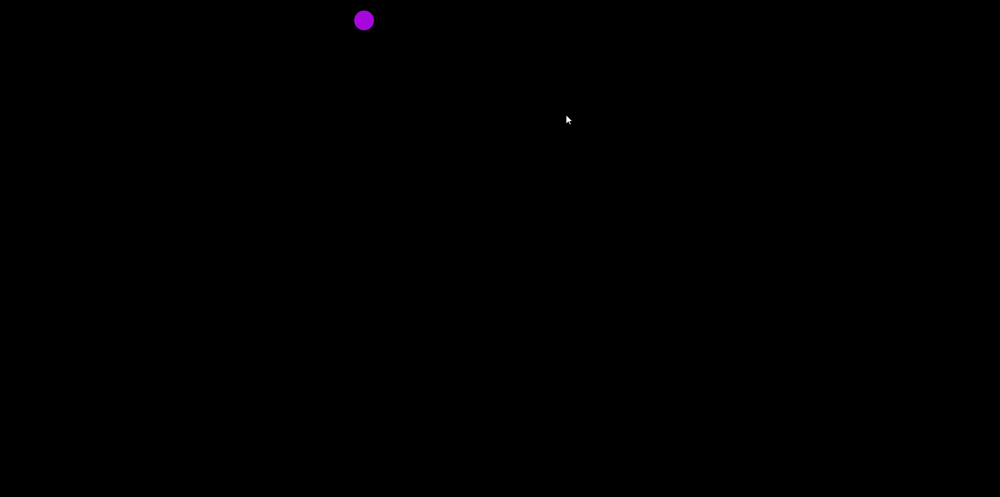

# Patatap-Clone
This is a Patatap clone made using HTML5, CSS3, Javascript. THe paper.js and howler.js libraries were used for the animations and sound. Sounds were taken from the Patatap Git repository.

### How it Works
You can press any key from a-z for a unique sound and circle color.

